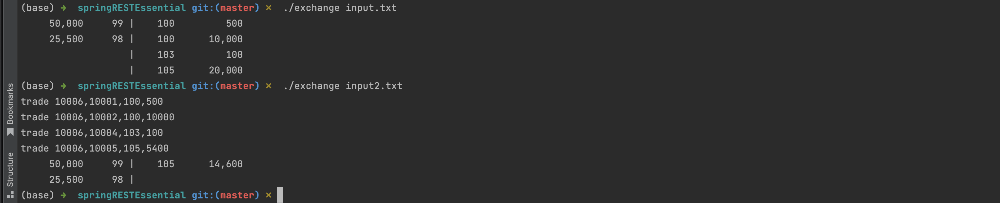
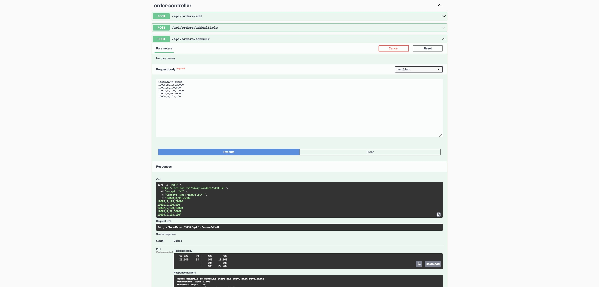
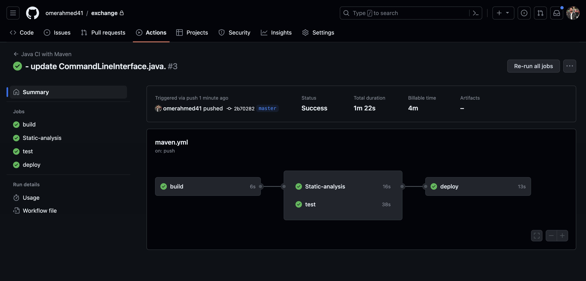

# Order Book Coding Assignment

## Context of the Problem

We operate a small, optimized exchange that must adhere to regulations and deterministic behavior. Although our exchange supports only one feature—limit orders—it's crucial to get it right. To validate our exchange's behavior, we compare its output with a verifier, which doesn't have performance constraints but must operate correctly.

## High-Level Description

An exchange enables buyers and sellers to discover each other and trade. Traders submit orders specifying their intent to buy or sell, the limit price (i.e., the worst price they're willing to trade at), and the quantity they wish to trade. Our exchange operates on 'continuous trading,' meaning trades occur immediately during the processing of a new order. The central limit order book (CLOB) is the primary mechanism for matching orders based on 'price-time priority.'

---

## Getting Started

### Command Line

```bash
$ ./exchange < test2.txt
```

#### Example Input and Output
Input example
* 10000,B,98,25500
* 10005,S,105,20000
* 10001,S,100,500
* 10002,S,100,10000
* 10003,B,99,50000
* 10004,S,103,100
* 10006,B,105,16000




### REST APIs

Access the application via HTTP requests. Swagger documentation is available for navigating between different endpoints.


---

## Key Features and Technologies

- **Spring Boot Starter**: The foundation for building Spring applications.
- **Spring Boot Starter Actuator**: Provides production-ready monitoring and management features.
- **Spring Security**: Implements both authentication and authorization.
- **Lombok**: Generates boilerplate Java code (e.g., getters, setters).
- **Spring Boot DevTools**: Enables rapid development with automatic application restarts.
- **Spring Data JPA with Hibernate**: For data persistence.
- **Flyway**: For database migrations.
- **Static Analysis and Style Checks**: Ensures code quality.
- **CI/CD with GitHub Actions**: For continuous integration and deployment.
- **Different Environments (Production/Development/Test)**: Configurable settings for various environments.
- **Databases**: Postgres and H2 in-memory database.
- **Testing**: JUnit, Mockito, and test coverage reports with JaCoCo.
- **DDD and Clean Architecture**: Follows Domain-Driven Design and Layered Architecture.
- **Makefile**: For build automation.
- **Docker and Docker Compose**: For containerization.
- **Kubernetes (K8s)**: For orchestration.
- **Project Lombok**: For reducing boilerplate code.
- **Logging**: Implemented with SLF4J.
- **OpenAPI with Swagger**: For API documentation.
- **Design Patterns and SOLID Principles**: Utilizes Singleton, Builder, and Factory patterns, along with Dependency Injection for loose coupling.

---

## Architecture

The project follows a three-layered structure:
- Application Layer
- Domain Layer
- Infrastructure Layer
- Database Layer

---

## Design Patterns, Dependency Injection, and SOLID Principles

Various design patterns like Singleton, Builder, and Factory have been employed. The project also adheres to SOLID principles and uses Dependency Injection for loose coupling.

---

## Static Analysis and Style Checks

(TBD)

---

## Testing

JUnit and Mockito are used for unit and integration tests, with coverage reports generated by JaCoCo.

---

## Pre-commit Hooks

To set up pre-commit hooks, run:

```bash
make pre-commit-setup
```

---

## CI/CD




---

## Environment Properties

Three environments are available: Development, Command, and Production. Each has unique configurations for logs, databases, and other settings.

---

## Database

H2 in-memory database is used for Development and Command environments, while Postgres is used for Production.

---

## Docker

To run the Postgres database inside Docker, use the following command:

```bash
docker-compose up

