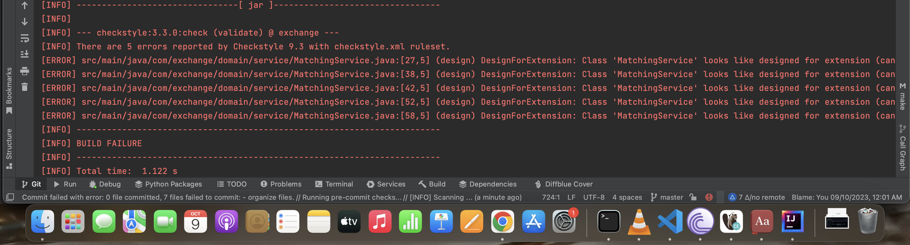
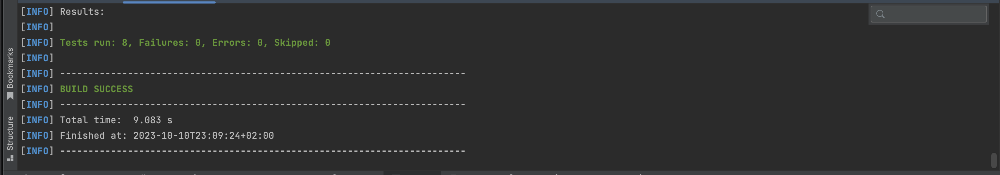
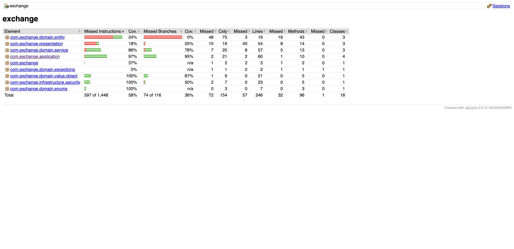
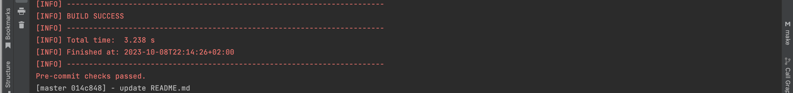

# Order Book Coding Assignment

## Context of the Problem

We operate a small, optimized exchange that must adhere to regulations and deterministic behavior. Although our exchange supports only one feature—limit orders—it's crucial to get it right. To validate our exchange's behavior, we compare its output with a verifier, which doesn't have performance constraints but must operate correctly.

## High-Level Description

An exchange enables buyers and sellers to discover each other and trade. Traders submit orders specifying their intent to buy or sell, the limit price (i.e., the worst price they're willing to trade at), and the quantity they wish to trade. Our exchange operates on 'continuous trading,' meaning trades occur immediately during the processing of a new order. The central limit order book (CLOB) is the primary mechanism for matching orders based on 'price-time priority.'

---

## Getting Started
You have two options to interact with the app.
### 1. Command Line
First option cmd, open terminal then make sure you on project path then run
```bash
$ ./exchange input.txt
```
```bash
$ ./exchange input2.txt
```

#### Example Input and Output
Input example
* 10000,B,98,25500
* 10005,S,105,20000
* 10001,S,100,500
* 10002,S,100,10000
* 10003,B,99,50000
* 10004,S,103,100
* 10006,B,105,16000


### 2. REST APIs
to start the app run this command, it will select port 8080, 
#### to select random port set`server.port=0` in the `src/main/resources/application.properties`.
```bash
./mvnw spring-boot:run
```
Access the application via HTTP requests on http://localhost:8080. Swagger documentation is available for navigating between different endpoints.


---

## Key Features and Technologies

- **Spring Boot Starter**: The foundation for building Spring applications.
- **Spring Boot Starter Actuator**: Provides production-ready monitoring and management features.
- **Spring Security**: Implements both authentication and authorization.
- **Lombok**: Generates boilerplate Java code (e.g., getters, setters).
- **Spring Boot DevTools**: Enables rapid development with automatic application restarts.
- **Spring Data JPA with Hibernate**: For data persistence.
- **Flyway**: For database migrations.
- **Static Analysis and Style Checks**: Ensures code quality.
- **CI/CD with GitHub Actions**: For continuous integration and deployment.
- **Different Environments (Production/Development/Test)**: Configurable settings for various environments.
- **Databases**: Postgres and H2 in-memory database.
- **Testing**: JUnit, Mockito, and test coverage reports with JaCoCo.
- **DDD and Clean Architecture**: Follows Domain-Driven Design and Layered Architecture.
- **Makefile**: For build automation.
- **Docker and Docker Compose**: For containerization.
- **Kubernetes (K8s)**: For orchestration.
- **Project Lombok**: For reducing boilerplate code.
- **Logging**: Implemented with SLF4J.
- **OpenAPI with Swagger**: For API documentation.
- **Design Patterns and SOLID Principles**: Utilizes Singleton, Builder, and Factory patterns, along with Dependency Injection for loose coupling.

---

## Architecture

The project follows the clean Architecture:
- Application Layer.
- Domain Layer.
- Infrastructure Layer.
- Database Layer.

* Each layer can call only the layer down to it. this architecture make it easy to replay DB, any service or any layer below the top ones.
---

## Design Patterns, Dependency Injection, and SOLID Principles

Various design patterns like Singleton, Builder, and Factory have been implemented.
The project also adheres to SOLID principles and uses Dependency Injection for loose coupling.

---

## Static Analysis and Style Checks
We added package for style checking on pre-commit hook or CI/CD.



---

## Testing
JUnit and Mockito are used for unit and integration tests, with coverage reports generated by JaCoCo.
* To Run all tests run:
```bash
./mvnw test 
```


* To run only integrations tests

```bash
  ./mvnw test -Dgroups=IntegrationTest
```
* To create test coverage report

```bash
  ./mvnw jacoco:report
```
* To see the Coverage report open:
target/site/jacoco/index.html



---

## Pre-commit Hooks



To set up pre-commit hooks, run:

```bash
make pre-commit-setup
```

---

## CI/CD
each time you push code to git repository and workflow will get triggered.


---

## Environment Properties

Three environments are available: Development, Command, and Production. Each has unique configurations for logs, databases, and other settings.

---

## Database

H2 in-memory database is used for Development and Command environments, while Postgres is used for Production.

---

## Docker

To run the Postgres database inside Docker, use the following command:

```bash
docker-compose up

